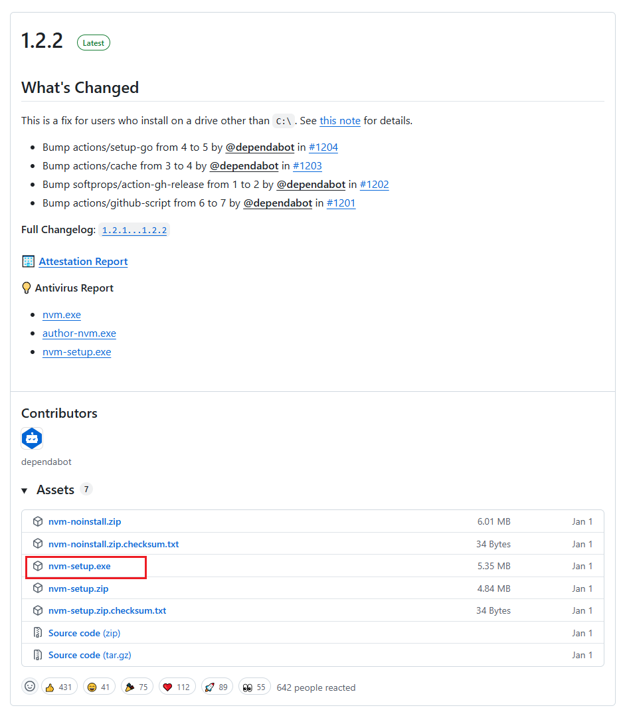
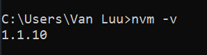

## 👨‍🔧 Installation

### NodeJS

1. Install NVM which allows you to manage and install multiple node versions on your computer. You can easily switch between node versions for each specific project you are working on. You can find the download page here https://github.com/coreybutler/nvm-windows/releases. At the latest section, click on `nvm-setup.exe` to download and then install it. You can download the latest version of `nvm` if the version you found on the page is higher than the version you see this guideline.

 <br />

2. Check the installation by opening the terminal and run the command `nvm -v`. If you installed the latest one, your command result might differ from mine.

 <br />

3. Install NodeJS via NVM (Node Version Manager) 

    ```
    nvm install 20.17.0
    nvm use 20.17.0
    ```

4. Check NodeJS installation `node -v`

### Install Angular and its dependencies

1. Before moving to the next step, make sure you have already installed NodeJS on your local machine.

2. If you don't build the project from scratch, and just clone this repo to run on your machine. You just need to run these following commands to install dependencies.

    Now, just open your terminal, navigate to cloned repo, and install dependencies
    ```
      cd CRM-ui
      npm install
    ```

## 💁 Usage
Run the server using this command

```
ng serve
```
or
```
npm start
```

## BE repository

https://github.com/ducbang1510/crm-services